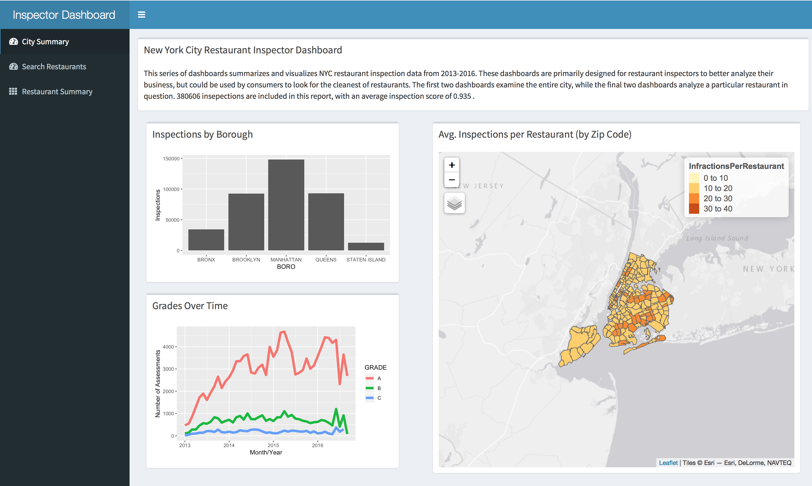
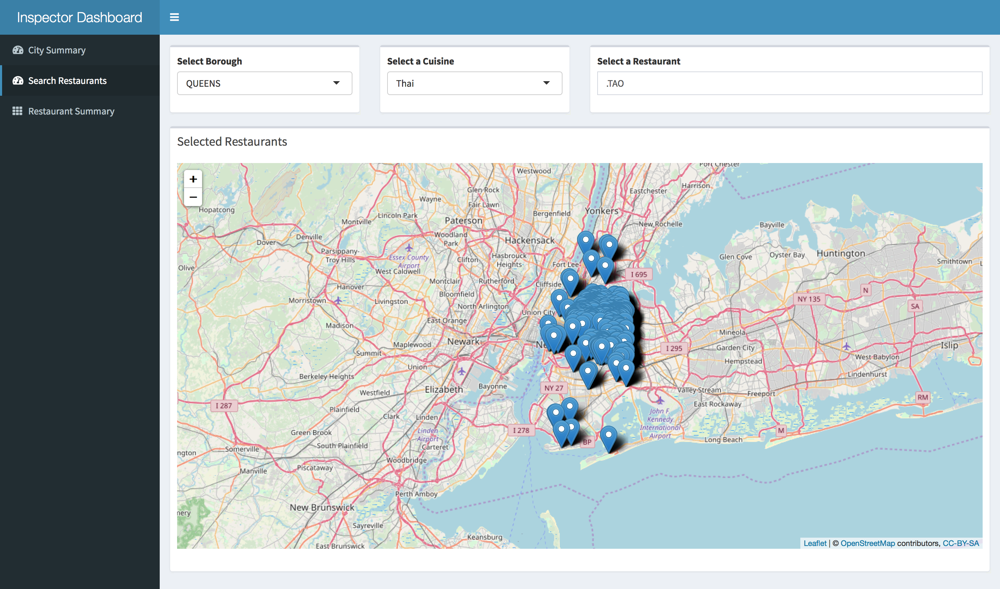
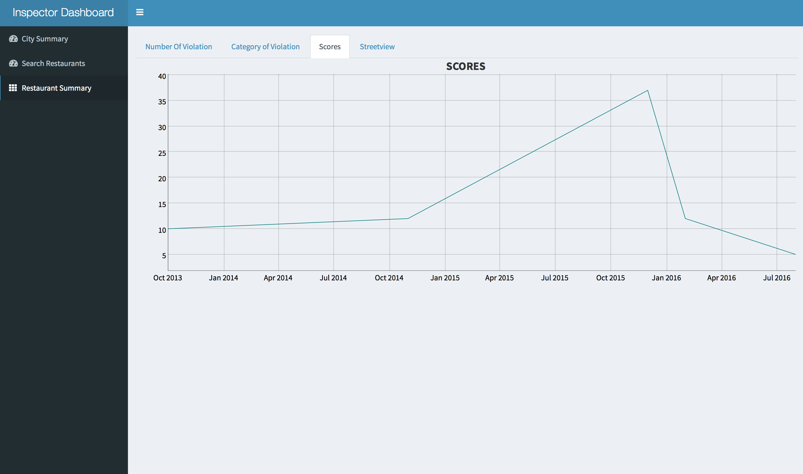

# Project 2: New York City Restaurant Inspector Dashboard

### [Project Description](doc/project2_desc.md)

The **learning goals** for this project is:

- business intelligence for data science
- study legacy codes and further development
- data cleaning
- data visualization
- systems development/design life cycle
- shiny app/shiny server & UI 

## New York City Restaurant Inspector Dashboard
Term: Spring 2019

+ Team 3
+ **New York City Restaurant Inspector Dashboard**: 
	+ Max Karsok
	+ Qiaozhen Ma
	+ Yu Shen
	+ Matthew Vitha

+ **Project summary**: Our team created a Shiny Dashboard App using NYC Restaurant Inspection data in efforts to analyze restaurants' histories of health violations. The dashboard is designed to assist Restaurant Inspectors in making easier and wiser inspection decisions. The dashboard can also be used by NYC restaurant patrons interested in observing inspection data trends for restaurants across the five Boroughs of NYC. There are 3 tabs in total. In the first tab named City Summary, the user can analyze Restaurant Inspection statistics on an aggregate level to gain a holistic view into the state of health insepections in NYC. In the second tab named Search Restaurants, the user can search for restaurants using an interactive map, filtering the number of restaurnts down based on which borough the restaurant is in, and which cuisine the restaurant features. Once the user has chosen a restaurant he or she wishes wants to further inspect based on the first two tabs, the user can access restaurant-specific information in the third tab named Restaurant Summary.

+ **Link**:https://maxkarsok.shinyapps.io/NYCRestaurantInspectorDashboard/

+ **Contribution statement**: Project2 Group3

Team members: Max Karsok, Qiaozhen Ma, Yu Shen, Matthew Vitha

[Contribution Statement] Max Karsok designs the first page. Matthew Vitha is responsible for dynamic map of New York city's restaurant. Qiaozhen Ma and Yu Shen summarize the information of each restaurant. All team members contribute to the GitHub repository and prepare the presentation. The team built an entirely new app to for this project, as apps built built previous teams did not function correctly even after hours spent debugging their code.  
